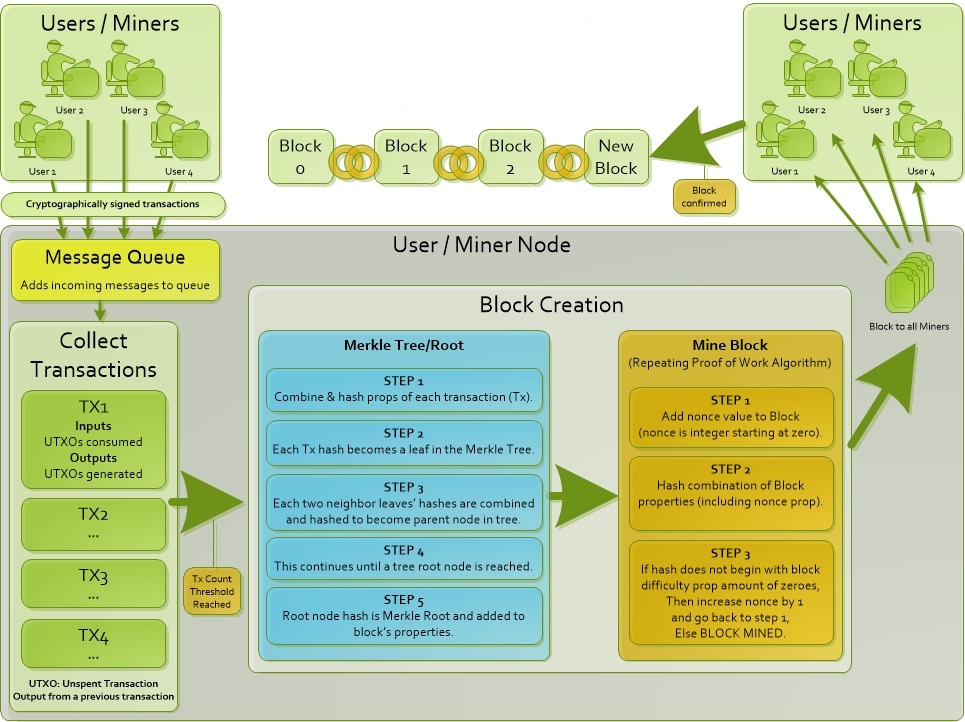

## This project will involve the creation of a Blockchain miner that does all the following:
###### - Receives transactions from user or remote node.
###### - Sends transactions to a remote node.
###### - Manages incoming remote node messages using a Queue.
###### - Generates a Merkle Tree and an eventual Merkle Root as part of Transaction processing.
###### - Creates Blockchain Blocks using Proof of Work algorithm.

